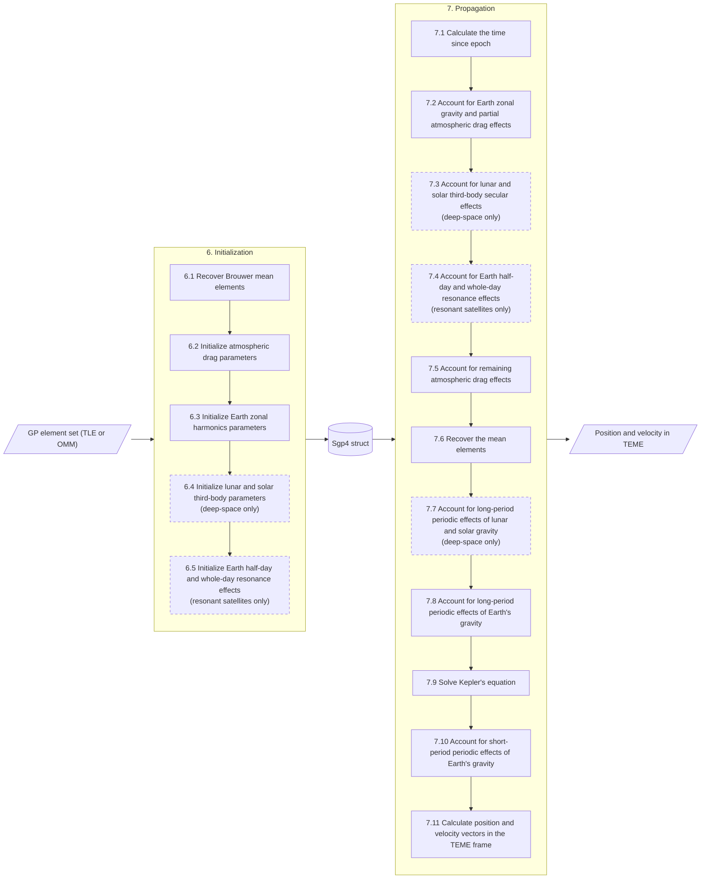

# mako-sgp4: Math Specification
**By [Mark Paral](https://markparal.com/)**

<p align="center">
  
</p>

**Abstract.** This document outlines the mathematics implemented by [mako-sgp4](https://github.com/markparal/mako-sgp4), a Rust implementation of the SGP4/SDP4 orbit propagator. It describes the general perturbation (GP) element set formats the crate ingests (TLE and OMM), the equations used to initialize the propagator, and the equations used to propagate the satellite state to a requested time. References to the source code are made throughout as this document is intended to be read alongside the code. The implementation follows the theory of Hoots et al. with the practical corrections of Vallado et al., and it is verified against both reference implementations to within 1 mm in position and 1 mm/s in velocity.

## Table of Contents
- [1. Introduction](#1-introduction)
- [2. SGP4 Historical Background](#2-sgp4-historical-background)
- [3. GP Element Sets](#3-gp-element-sets)
    - [3.1 Two-Line Element (TLE) Format](#31-two-line-element-tle-format)
    - [3.2 Orbit Mean-Elements Message (OMM) Format](#32-orbit-mean-elements-message-omm-format)
- [4. Notation and Conventions](#4-notation-and-conventions)
    - [4.1 Units](#41-units)
    - [4.2 Symbols and Subscripts](#42-symbols-and-subscripts)
    - [4.3 Conventions](#43-conventions)
    - [4.4 Acronyms](#44-acronyms)
- [5. SGP4 Algorithm Overview](#5-sgp4-algorithm-overview)
- [6. Initialization](#6-initialization)
    - [6.1 Recover Brouwer Mean Elements](#61-recover-brouwer-mean-elements)
    - [6.2 Initialize Atmospheric Drag Parameters](#62-initialize-atmospheric-drag-parameters)
    - [6.3 Initialize Earth Zonal Harmonics Parameters](#63-initialize-earth-zonal-harmonics-parameters)
    - [6.4 Initialize Lunar and Solar Third-Body Parameters](#64-initialize-lunar-and-solar-third-body-parameters)
    - [6.5 Initialize Earth Half-Day and Whole-Day Resonance Effects](#65-initialize-earth-half-day-and-whole-day-resonance-effects)
- [7. Propagation](#7-propagation)
    - [7.1 Calculate the Time Since Epoch](#71-calculate-the-time-since-epoch)
    - [7.2 Account for Earth Zonal Gravity and Partial Atmospheric Drag Effects](#72-account-for-earth-zonal-gravity-and-partial-atmospheric-drag-effects)
    - [7.3 Account for Lunar and Solar Third-Body Secular Effects](#73-account-for-lunar-and-solar-third-body-secular-effects)
    - [7.4 Account for Earth Half-Day and Whole-Day Resonance Effects](#74-account-for-earth-half-day-and-whole-day-resonance-effects)
    - [7.5 Account for Remaining Atmospheric Drag Effects](#75-account-for-remaining-atmospheric-drag-effects)
    - [7.6 Recover the Mean Elements](#76-recover-the-mean-elements)
    - [7.7 Account for Long-Period Periodic Effects of Lunar and Solar Gravity](#77-account-for-long-period-periodic-effects-of-lunar-and-solar-gravity)
    - [7.8 Account for Long-Period Periodic Effects of Earth's Gravity](#78-account-for-long-period-periodic-effects-of-earths-gravity)
    - [7.9 Solve Kepler's Equation](#79-solve-keplers-equation)
    - [7.10 Account for Short-Period Periodic Effects of Earth's Gravity](#710-account-for-short-period-periodic-effects-of-earths-gravity)
    - [7.11 Calculate Position and Velocity Vectors in the TEME Frame](#711-calculate-position-and-velocity-vectors-in-the-teme-frame)
- [8. Verification](#8-verification)
- [Appendix A: World Geodetic System (WGS) Models](#appendix-a-world-geodetic-system-wgs-models)
- [Appendix B: Constants for the Sun and Moon](#appendix-b-constants-for-the-sun-and-moon)
- [Appendix C: Constants for Earth Resonance](#appendix-c-constants-for-earth-resonance)
- [Thanks](#thanks)
- [Revision History](#revision-history)
- [References](#references)

## 1. Introduction
On October 4th, 1957, Sputnik was launched into orbit by the Soviet Union. With the opening of space for artificial satellites, the urgent need to catalog and track all objects around the Earth became apparent. Thanks to the efforts of numerous members of the US military and scientific community, new theories were developed and infrastructure put in place to realize these goals. Today, these tools act as the backbone of modern space situational awareness (SSA). 

Critical to this infrastructure is the Simplified General Perturbations 4 model (SGP4), which, using provided general perturbation element sets (GPs), generates reliably accurate (sub-1 km position error at epoch) position and velocity state estimates for each cataloged orbiting object. Originally implemented in 1970, SGP4 strikes a difficult balance between computational efficiency and accuracy as a semianalytical orbital propagator. The impressiveness of this achievement cannot be overstated, as it remains one of, if not the most, important propagator in the industry nearly 56 years later (as of 2026).

As a member of the space community who makes active use of these SSA resources, [mako-sgp4](https://github.com/markparal/mako-sgp4) ([10]) was developed to gain a deeper understanding of the underlying theory behind this immensely important model. It combines both the theory detailed in *History of Analytical Orbit Modeling in the U.S. Space Surveillance System* by Hoots et al. ([9]) and the practical implementation fixes perscribed in *Revisiting Spacetrack Report #3: Rev 3* by Vallado et al. ([14]). The rest of this document will dive into this theory to facilitate understanding of the codebase.

## 2. SGP4 Historical Background
For a complete historical rundown of the development of SGP4, it is recommended to read *History of Analytical Orbit Modeling in the U.S. Space Surveillance System* by Hoots et al. ([9]), which details the creation and evolution of the U.S. Space Surveillance system. This paper also discusses the various theories and works that contributed to the modern SGP4 algorithm. A (non-exhaustive) list includes:
- The effects of the J2, J3, and J4 Earth zonal harmonics on the orbit of a satellite ([1], [2])
- The effects of atmospheric drag on the orbits of satellites ([3], [4], [6])
- The avoidance of small divisors of eccentricity or sine of inclination in propagation ([5])
- The inclusion of lunar and solar gravitational effects as well as Earth tesseral harmonics ([7], [8])

## 3. GP Element Sets

| Field | Symbol | Units | Description |
| --- | --- | --- | --- |
| Common Name | - | - | The commonly used name for the satellite |
| Satellite Catalog Number | - | - | NORAD satellite catalog number (NORAD ID) |
| Classification | - | - | Security classification (`U` = Unclassified, `C` = Classified, `S` = Secret) |
| International Designator | - | - | International designator in `Y-NP` form, where `Y` is launch year (4+ digits), `N` is launch number of that year (3+ digits), and `P` is piece of launch (1+ characters) |
| Epoch Datetime | $t_{0}$ | UTC | UTC epoch datetime of the GP elements |
| First Derivative of Mean Motion | $\dot{n}_K$ | revolutions/day^2 | Kozai first time derivative of mean motion (unused in SGP4) |
| Second Derivative of Mean Motion | $\ddot{n}_K$ | revolutions/day^3 | Kozai second time derivative of mean motion (unused in SGP4) |
| B* | $B^{*}$ | 1/Earth radii | Atmospheric drag coefficient |
| Ephemeris Type | - | - | Ephemeris type (always zero) |
| Element Set Number | - | - | Element set number |
| Inclination | $i_B$ | degrees | Orbital inclination |
| Right Ascension of Ascending Node | $\Omega_B$ | degrees | Orbital right ascension of the ascending node (RAAN) |
| Eccentricity | $e_B$ | - | Orbital eccentricity |
| Argument of Perigee | $\omega_B$ | degrees | Orbital argument of perigee |
| Mean Anomaly | $M_B$ | degrees | Orbital mean anomaly |
| Mean Motion | $n_{K}$ | revolutions/day | Kozai Mean motion |
| Revolution Number at Epoch | - | revs | Revolution number at epoch |

<p align="center"><strong>Table 1.</strong> Standard GP element set fields</p>

The units in Table 1 are the units the fields are distributed in (see Section 4 for the units used in the equations).

The contents of GP element sets are described in Table 1 above. These elements characterize the orbit of a satellite and are what SGP4 uses to propagate the position and velocity over time. There are two primary formats for the distribution and ingestion of GP element sets: the two-line element (TLE) format and the orbit mean-elements message (OMM) format.

### 3.1 Two-Line Element (TLE) Format
The TLE formats all the necessary GP elements into two lines. An example of this is given below.

```
ISS (ZARYA)
1 25544U 98067A   08264.51782528 -.00002182 -00100-2 -11606-4 0  2921
2 25544  51.6416 247.4627 0006703 130.5360 325.0288 15.72125391563537
```

A detailed breakdown of the TLE format and its associated fields can be found at [11]. The standard format follows the convention depicted below, where `N` is a number 0-9 (or a space in certain cases), `C` is the classification character, `P` is any character A-Z (or a space in certain cases), `+` indicates either a '+', '-', or space must be present, `-` indicates a '+' or '-' must be present, `A` is the Alpha-5 encoded digit which can be a character (excluding I and O), digit, or space, and `D` is any printable character or space. Note that line 0 is optional. Table 2 describes what character correspond to what element field.

```
DDDDDDDDDDDDDDDDDDDDDDDD
1 ANNNNC NNNNNPPP NNNNN.NNNNNNNN +.NNNNNNNN +NNNNN-N +NNNNN-N N NNNNN
2 ANNNN NNN.NNNN NNN.NNNN NNNNNNN NNN.NNNN NNN.NNNN NN.NNNNNNNNNNNNNN
```

| Line | Characters | Field | Units | Notes |
| --- | --- | --- | --- | --- |
| 0 | 0-23 | Common Name | - | Optional |
| 1 | 0 | Line Number | - | Always `1` |
| 1 | 2-6 | Satellite Catalog Number | - | NORAD ID, Alpha-5 encoding allowed ([12]) |
| 1 | 7 | Classification | - | `U` = Unclassified, `C` = Classified, `S` = Secret |
| 1 | 9-10 | International Designator | - | Last two digits of launch year |
| 1 | 11-13 | International Designator | - | Launch number of the year |
| 1 | 14-16 | International Designator | - | Piece of the launch |
| 1 | 18-19 | Epoch Datetime | - | Last two digits of year |
| 1 | 20-31 | Epoch Datetime | days | Day of year and fractional portion of the day |
| 1 | 33-42 | First Derivative of Mean Motion | revolutions/day^2 | TLE stores value divided by two |
| 1 | 44-51 | Second Derivative of Mean Motion | revolutions/day^3 | TLE stores value divided by six, decimal point assumed |
| 1 | 53-60 | B* | 1/Earth radii | Decimal point assumed |
| 1 | 62 | Ephemeris Type | - | Always `0` |
| 1 | 64-67 | Element Set Number | - | |
| 1 | 68 | Checksum | - | Modulo 10 |
| 2 | 0 | Line Number | - | Always `2` |
| 2 | 2-6 | Satellite Catalog Number | - | Must match line 1 |
| 2 | 8-15 | Inclination | degrees | |
| 2 | 17-24 | Right Ascension of Ascending Node | degrees | |
| 2 | 26-32 | Eccentricity | - | Decimal point assumed |
| 2 | 34-41 | Argument of Perigee | degrees | |
| 2 | 43-50 | Mean Anomaly | degrees | |
| 2 | 52-62 | Mean Motion | revolutions/day | |
| 2 | 63-67 | Revolution Number at Epoch | revs | |
| 2 | 68 | Checksum | - | Modulo 10 |

<p align="center"><strong>Table 2.</strong> TLE format (zero-based indexing)</p>

While the TLE has traditionally been the GP format of choice, it has several deficiencies which make switching to a new format (OMM) necessary in the coming years. Some examples include:
1. The limiting of epochs and international designators to years between 1957 and 2056
2. The limiting of NORAD IDs to 339999 (even with Alpha-5 encoding)
3. International designators can only represent launches up to 999 in a single year
4. International designators can only represent pieces of a launch up to a 3-character code

All of these issues are alleviated with the OMM format.

### 3.2 Orbit Mean-Elements Message (OMM) Format
The OMM format assigns values to keywords. These keywords correspond to the necessary GP elements. An example of this is given below.

```
CCSDS_OMM_VERS = 2.0
CREATION_DATE  = 
ORIGINATOR     = 

OBJECT_NAME    = 2026-106A
OBJECT_ID      = 2026-106A
CENTER_NAME    = EARTH
REF_FRAME      = TEME
TIME_SYSTEM    = UTC
MEAN_ELEMENT_THEORY = SGP/SGP4

EPOCH          = 2026-06-14T15:07:48.259488
MEAN_MOTION    = 15.11169557
ECCENTRICITY   = .00147468
INCLINATION    = 97.5103
RA_OF_ASC_NODE = 247.7605
ARG_OF_PERICENTER = 169.6213
MEAN_ANOMALY   = 190.5325

EPHEMERIS_TYPE = 0
CLASSIFICATION_TYPE = U
NORAD_CAT_ID   = 69097
ELEMENT_SET_NO = 999
REV_AT_EPOCH   = 459
BSTAR          = .39221734E-3
MEAN_MOTION_DOT = .6535E-4
MEAN_MOTION_DDOT = 0
```

The standards for the OMM format and its associated fields can be found at [13]. Table 3 describes what keyword correspond to what element field.

| Keyword | Field | Units | Notes |
| --- | --- | --- | --- |
| CCSDS_OMM_VERS | - | - | Typically `2.0` |
| CREATION_DATE | - | - | Optional |
| ORIGINATOR | - | - | Optional |
| OBJECT_NAME | Common Name | - | Optional |
| OBJECT_ID | International Designator | - | Full `Y-NP` form |
| CENTER_NAME | - | - | Always `EARTH` |
| REF_FRAME | - | - | Always `TEME` |
| TIME_SYSTEM | - | - | Always `UTC` |
| MEAN_ELEMENT_THEORY | - | - | `SGP/SGP4` for the public catalog |
| EPOCH | Epoch Datetime | UTC | ISO-8601 UTC |
| MEAN_MOTION | Mean Motion | revolutions/day | |
| ECCENTRICITY | Eccentricity | - | |
| INCLINATION | Inclination | degrees | |
| RA_OF_ASC_NODE | Right Ascension of Ascending Node | degrees | |
| ARG_OF_PERICENTER | Argument of Perigee | degrees | |
| MEAN_ANOMALY | Mean Anomaly | degrees | |
| EPHEMERIS_TYPE | Ephemeris Type | - | Always `0` |
| CLASSIFICATION_TYPE | Classification | - | `U` = Unclassified, `C` = Classified, `S` = Secret |
| NORAD_CAT_ID | Satellite Catalog Number | - | Integer NORAD ID |
| ELEMENT_SET_NO | Element Set Number | - | |
| REV_AT_EPOCH | Revolution Number at Epoch | revs | |
| BSTAR | B* | 1/Earth radii | |
| MEAN_MOTION_DOT | First Derivative of Mean Motion | revolutions/day^2 | OMM stores value divided by two (Space-Track standard, not CCSDS) |
| MEAN_MOTION_DDOT | Second Derivative of Mean Motion | revolutions/day^3 | OMM stores value divided by six (Space-Track standard, not CCSDS) |

<p align="center"><strong>Table 3.</strong> OMM format</p>

Because the OMM format follows a keyword-value pattern, it exists in multiple general-purpose data formats as well, including KVN (as the example above shows), XML, JSON, and CSV.

## 4. Notation and Conventions

### 4.1 Units
Unless stated otherwise, the equations in Sections 6 and 7 use the internal SGP4 units below. Conversions to and from the distribution units (Table 1) and the output units (km and km/s) are noted where they occur.

| Quantity | Internal Unit | Notes |
| --- | --- | --- |
| Distance | Earth radii | $a_E = 1$ Earth radius $= R_e$ km (Appendix A) |
| Time | minutes | $t$ is the time since the GP element set epoch |
| Angles | radians | GP angles $i_B$, $\Omega_B$, $\omega_B$, $M_B$ are converted from degrees |
| Mean motion | radians/min | $n_K$ is converted from revolutions/day by $n_K \cdot 2\pi / 1440$ |
| Rates | per minute | Except the lunar and solar constants in Appendix B, which are per day |
| Dates | days | Julian dates in UTC |

<p align="center"><strong>Table 4.</strong> Internal units</p>

### 4.2 Symbols and Subscripts
- Subscript $B$ denotes a Brouwer mean element (e.g., $n_B$), and subscript $K$ denotes the Kozai mean motion distributed in the GP element set ($n_K$).
- Subscript $X$ denotes a third body, with $X = M$ for the Moon and $X = S$ for the Sun.
- Subscript $0$ denotes a value at a reference epoch, either the GP element set epoch or the lunar/solar element epoch $t_{SM}$.
- $\theta_B = \cos i_B$ and $\beta_B = \sqrt{1 - e_B^2}$.
- A dot denotes a time derivative, e.g., $\dot{\Omega}_B$ is a secular rate of the right ascension of the ascending node.
- $J_n$ are zonal harmonics, and $k_2 = \frac{1}{2} J_2 a_E^2$ and $k_4 = -\frac{3}{8} J_4 a_E^4$ are the normalized zonal constants. $Q_{lm}$ and $\lambda_{lm}$ are the amplitude and phase of the $(l, m)$ tesseral harmonic.

### 4.3 Conventions
- $x \bmod 2\pi$ is the Euclidean remainder (Rust `rem_euclid` on `f64`), so the result is always in $[0, 2\pi)$.
- $\mathrm{fmod}(x, 2\pi)$ follows C `fmod` semantics (Rust `%` on `f64`), so the result keeps the sign of $x$ and lies in $(-2\pi, 2\pi)$. This matters for the mean element recovery in Section 7.6.
- $\mathrm{atan2}(y, x)$ is the four-quadrant inverse tangent.
- $x \mathrel{+}= y$ and $x \mathrel{-}= y$ add $y$ to or subtract $y$ from the current value of a time-varying element $x$ during propagation (Section 7).
- Equations are numbered by section, e.g., Eq. (6.2.3) is the third equation in Section 6.2.

### 4.4 Acronyms
| Acronym | Meaning |
| --- | --- |
| CCSDS | Consultative Committee for Space Data Systems |
| COSPAR | Committee on Space Research (international designator authority) |
| ECI | Earth-centered inertial |
| GMST | Greenwich mean sidereal time |
| GP | General perturbations (element set) |
| IAU | International Astronomical Union |
| JD | Julian date |
| MJD | Modified Julian date |
| KVN | Keyword-value notation |
| NORAD | North American Aerospace Defense Command (catalog number authority) |
| OMM | Orbit mean-elements message |
| RAAN | Right ascension of the ascending node |
| SDP4 | Simplified deep-space perturbations 4 (the deep-space extension of SGP4) |
| SGP4 | Simplified general perturbations 4 |
| SSA | Space situational awareness |
| TEME | True equator, mean equinox |
| TLE | Two-line element set |
| UTC | Coordinated universal time |
| UT1 | Universal time 1 (Earth rotation angle time scale) |
| WGS | World geodetic system |

<p align="center"><strong>Table 5.</strong> Acronyms</p>

## 5. SGP4 Algorithm Overview
As stated previously, the goal of the SGP4 propagator is to find a balance between accuracy and efficiency. Given the need for efficient propagation, only important orbital perturbations are calculated in SGP4. These perturbations include:
- The J2, J3, and J4 Earth zonal harmonic effects
- The atmospheric drag effects
- The 3rd body effects of the sun and moon
- The J22, J31, J32, J33, J44, J52, and J54 Earth tesseral effects

The standard Earth model used by SGP4 is WGS-72 (see Table A1). The standard reference frame used for position and velocity is True Equator Mean Equinox (TEME), an Earth-Centered Inertial (ECI) coordinate frame.

The SGP4 algorithm can be broken into two primary phases:
1. Initialization - Calculating the time-independent propagation terms
2. Propagation - Calculating the satellite state at a given time

### 5.1 Diagram
The flow of the SGP4 algorithm through the initialization (Section 6) and propagation (Section 7) phases is shown in Figure 1. Initialization runs once per GP element set and stores its results in an `Sgp4` struct. Propagation reads that struct and runs once for each requested time. Steps with a dashed outline are only applied to some satellites, as noted in each step.



<p align="center"><strong>Figure 1.</strong> SGP4 initialization and propagation flow (deep-space satellites have an orbital period of at least 225 min, Eq. (6.4.1); resonance criteria are given in Eqs. (6.5.1)–(6.5.2))</p>

## 6. Initialization
Initialization starts from a GP element set (see Table 1). The goal in the initialization process is to calculate the values required for propagation that are independent of time. In mako-sgp4, these values are stored in `Sgp4` structs. 

At a high level, the initialization process can be broken into a series of steps that will be covered individually. These steps are
1. Recover Brouwer mean elements
2. Initialize atmospheric drag parameters
3. Initialize Earth zonal harmonics parameters
4. Initialize lunar and solar third-body parameters
5. Initialize Earth half-day and whole-day resonance effects

### 6.1 Recover Brouwer Mean Elements
Implemented in `init_sgp4` (`src/sgp4.rs`), stored in `Sgp4.brouwer0`.

We will define the Brouwer mean element set with Table 6 below.

| Element | Symbol | Units | Definition | Code |
| --- | --- | --- | --- | --- |
| Inclination | $i_{B}$ | radians | Orbital inclination | `brouwer0.i` |
| Theta | $\theta_{B}$ | - | Cosine of inclination, $\theta_{B} = \cos i_{B}$ | `brouwer0.theta` |
| Right Ascension of Ascending Node | $\Omega_{B}$ | radians | Right ascension of the ascending node (RAAN) | `brouwer0.raan` |
| Eccentricity | $e_{B}$ | - | Orbital eccentricity | `brouwer0.e` |
| Beta | $\beta_{B}$ | - | $\beta_{B} = \sqrt{1 - e_{B}^{2}}$ | `brouwer0.beta` |
| Argument of Perigee | $\omega_{B}$ | radians | Argument of perigee | `brouwer0.omega` |
| Mean Anomaly | $M_{B}$ | radians | Mean anomaly | `brouwer0.m` |
| Mean Motion | $n_{B}$ | radians/min | Brouwer mean motion | `brouwer0.n` |
| Semi-major Axis | $a_{B}$ | Earth radii | Semi-major axis | `brouwer0.a` |
| Period | $T_{B}$ | min | Orbital period | `brouwer0.period` |

<p align="center"><strong>Table 6.</strong> Brouwer mean element set (Code fields are on <code>Sgp4</code>)</p>

Many of these values are consistent with what is provided via the GP element set (with unit conversions). The main lift in this step is to convert the Kozai mean motion ($n_{K}$) into the Brouwer mean motion ($n_{B}$). This process is detailed in Eqs. (6.1.1)–(6.1.5).

$$
a_1 = \left(\frac{k_e}{n_{K}}\right)^{2/3} \tag{6.1.1}
$$

$$
\delta_1 = \frac{3}{2} \frac{k_2}{a_1^2} \frac{(3 \theta_B^2 - 1)}{(1 - e_B^2)^{3/2}} \tag{6.1.2}
$$

$$
a_2 = a_1 (1 - \frac{1}{3} \delta_1 - \delta_1^2 - \frac{134}{81} \delta_1^3) \tag{6.1.3}
$$

$$
\delta_0 = \frac{3}{2} \frac{k_2}{a_2^2} \frac{(3 \theta_B^2 - 1)}{(1 - e_B^2)^{3/2}} \tag{6.1.4}
$$

$$
n_B = \frac{n_K}{1 + \delta_0} \tag{6.1.5}
$$

With the Brouwer mean motion, extract the semi-major axis and orbital period as well with Eqs. (6.1.6)–(6.1.7).

$$
a_B = \left(\frac{k_e}{n_B}\right)^{2/3} \tag{6.1.6}
$$

$$
T_B = 2 \pi \frac{\sqrt{(a_B R_e)^3 / \mu_e}}{60} \tag{6.1.7}
$$

### 6.2 Initialize Atmospheric Drag Parameters
Implemented in `init_atm_effects` (`src/sgp4.rs`), stored in `Sgp4.atm_params`.

We will define the atmospheric drag parameters with Table 7 below.

| Parameter | Symbol | Units | Definition | Code |
| --- | --- | --- | --- | --- |
| Perigee Height | $h_{p}$ | km | Perigee height | `atm_params.hp` |
| Reference Distance | $q_{0}$ | Earth radii | Reference distance from the center of the Earth used in the power-law density function (equal to 120km in altitude) | `atm_params.q0` |
| s | $s$ | Earth radii | Parameter of the power-law density function | `atm_params.s` |
| Zeta | $\zeta$ | 1 / Earth radii | $\zeta = 1 / (a_{B} - s)$ | `atm_params.zeta` |
| Eta | $\eta$ | - | $\eta = a_{B} e_{B} \zeta$ | `atm_params.eta` |
| C1 | $C_{1}$ | 1 / min | Drag coefficient | `atm_params.c1` |
| C3 | $C_{3}$ | Earth radii / min | Drag coefficient | `atm_params.c3` |
| C4 | $C_{4}$ | Earth radii / min | Drag coefficient | `atm_params.c4` |
| C5 | $C_{5}$ | Earth radii | Drag coefficient | `atm_params.c5` |
| D2 | $D_{2}$ | 1 / min^2 | Higher-order drag coefficient | `atm_params.d2` |
| D3 | $D_{3}$ | 1 / min^3 | Higher-order drag coefficient | `atm_params.d3` |
| D4 | $D_{4}$ | 1 / min^4 | Higher-order drag coefficient | `atm_params.d4` |

<p align="center"><strong>Table 7.</strong> Atmospheric drag parameters</p>

Atmospheric drag modeling in SGP4 is based on the power-law density function given in Eq. (6.2.1), where $r$ is the radial distance between the satellite and the center of the Earth, $\rho$ is the atmospheric density, and $\rho_0$ is the reference atmospheric density at a distance $q_0$ from the center of the Earth.

$$
\rho = \rho_0 (q_0 - s)^4 / (r - s)^4 \tag{6.2.1}
$$

Because $q_0$ is a reference, it is always the same constant given by Eq. (6.2.2).

$$
q_0 = (120 + R_e) / R_e \tag{6.2.2}
$$

The perigee height is given by Eq. (6.2.3).

$$
h_p = R_e \left(a_B (1 - e_B) - 1 \right) \tag{6.2.3}
$$

The parameter $s$ is defined as a piecewise function of $h_p$ in Eq. (6.2.4).

$$
s = \begin{cases}
(78 + R_e) / R_e & h_p \ge 156 \\
(h_p - 78 + R_e) / R_e & 98 \le h_p < 156 \\
(20 + R_e) / R_e & h_p < 98
\end{cases} \tag{6.2.4}
$$

Additional constants are defined with Eqs. (6.2.5)–(6.2.8) ($A_{3,0}$ is in units of Earth Radii^3)

$$
A_{3,0} = -J_3 R_e^3 / R_e^3 \tag{6.2.5}
$$

$$ 
\zeta = \frac{1}{a_B - s} \tag{6.2.6}
$$

$$
\eta = a_B e_B \zeta \tag{6.2.7}
$$

$$
\psi^2 = |1 - \eta^2| \tag{6.2.8}
$$

Drag coefficients are defined with Eqs. (6.2.9)–(6.2.13). $C_3$ is set to zero for small eccentricity to avoid division by $e_B$.

$$
\begin{aligned}
C_2 &= (q_0 - s)^4 \zeta^4 n_B \left(\psi^2\right)^{-7/2} \\
&\qquad \times \Biggl[ a_B \left(1 + \frac{3}{2} \eta^2 + 4 e_B \eta + e_B \eta^3\right) \\
&\qquad + \frac{3}{2} \frac{k_2 \zeta}{\psi^2} \left(-\frac{1}{2} + \frac{3}{2} \theta_B^2\right) \left(8 + 24 \eta^2 + 3 \eta^4\right) \Biggr]
\end{aligned}
\tag{6.2.9}
$$

$$
C_1 = B^{*} C_2 \tag{6.2.10}
$$

$$
C_3 = \begin{cases}
\dfrac{(q_0 - s)^4 \zeta^5 A_{3,0} n_B \sin i_B}{k_2 e_B} & e_B > 10^{-4} \\
0 & e_B \le 10^{-4}
\end{cases} \tag{6.2.11}
$$

$$
\begin{aligned}
C_4 &= 2 n_B (q_0 - s)^4 \zeta^4 a_B \beta_B^2 \left(\psi^2\right)^{-7/2} \\
&\qquad \times \Biggl[ 2\eta \left(1 + e_B \eta\right) + \frac{1}{2} e_B + \frac{1}{2} \eta^3 \\
&\qquad - \frac{2 k_2 \zeta}{a_B \psi^2} \Biggl( \\
&\qquad\qquad 3\left(1 - 3\theta_B^2\right)\left(1 + \frac{3}{2}\eta^2 - 2 e_B \eta - \frac{1}{2} e_B \eta^3\right) \\
&\qquad\qquad + \frac{3}{4}\left(1 - \theta_B^2\right)\left(2\eta^2 - e_B \eta - e_B \eta^3\right) \cos\left(2\omega_B\right) \Biggr) \Biggr]
\end{aligned}
\tag{6.2.12}
$$

$$
\begin{aligned}
C_5 &= 2 (q_0 - s)^4 \zeta^4 a_B \beta_B^2 \left(\psi^2\right)^{-7/2} \\
&\qquad \times \left(1 + \frac{11}{4} \eta\left(\eta + e_B\right) + e_B \eta^3\right)
\end{aligned}
\tag{6.2.13}
$$

Higher-order drag coefficients are defined with Eqs. (6.2.14)–(6.2.16).

$$
D_2 = 4 a_B \zeta C_1^2 \tag{6.2.14}
$$

$$
D_3 = \frac{4}{3} a_B \zeta^2 \left(17 a_B + s\right) C_1^3 \tag{6.2.15}
$$

$$
D_4 = \frac{2}{3} a_B^2 \zeta^3 \left(221 a_B + 31 s\right) C_1^4 \tag{6.2.16}
$$

### 6.3 Initialize Earth Zonal Harmonics Parameters
Implemented in `init_zonal_effects` (`src/sgp4.rs`), stored in `Sgp4.zonal_params`.

We will define the Earth zonal harmonics parameters with Table 8 below.

| Parameter | Symbol | Units | Definition | Code |
| --- | --- | --- | --- | --- |
| Mean Anomaly Rate | $\dot{M}_{B}$ | radians/min | Secular rate of change of mean anomaly due to the zonal harmonics, excluding the mean motion $n_B$ | `zonal_params.m_dot` |
| Argument of Perigee Rate | $\dot{\omega}_{B}$ | radians/min | Secular rate of change of argument of perigee | `zonal_params.omega_dot` |
| Right Ascension of Ascending Node Rate | $\dot{\Omega}_{B}$ | radians/min | Secular rate of change of the right ascension of the ascending node (RAAN) | `zonal_params.raan_dot` |

<p align="center"><strong>Table 8.</strong> Earth zonal harmonics parameters</p>

The Earth zonal harmonics in SGP4 consider the impacts of $J_2$ and $J_4$. The resulting secular rates of the Brouwer mean elements are given in Eqs. (6.3.1)–(6.3.3). Note that $\dot{M}_B$ excludes the unperturbed motion $n_B$, so the total secular rate of the mean anomaly is $n_B + \dot{M}_B$.

$$
\begin{aligned}
\dot{M}_B &= n_B \Biggl[
\frac{3 k_2 \left(-1 + 3 \theta_B^{2}\right)}{2 a_B^{2} \beta_B^{3}} \\
&\qquad + \frac{3 k_2^{2} \left(13 - 78 \theta_B^{2} + 137 \theta_B^{4}\right)}{16 a_B^{4} \beta_B^{7}}
\Biggr]
\end{aligned}
\tag{6.3.1}
$$

$$
\begin{aligned}
\dot{\omega}_B &= n_B \Biggl[
-\frac{3 k_2 \left(1 - 5 \theta_B^{2}\right)}{2 a_B^{2} \beta_B^{4}} \\
&\qquad + \frac{3 k_2^{2} \left(7 - 114 \theta_B^{2} + 395 \theta_B^{4}\right)}{16 a_B^{4} \beta_B^{8}} \\
&\qquad + \frac{5 k_4 \left(3 - 36 \theta_B^{2} + 49 \theta_B^{4}\right)}{4 a_B^{4} \beta_B^{8}}
\Biggr]
\end{aligned}
\tag{6.3.2}
$$

$$
\begin{aligned}
\dot{\Omega}_B &= n_B \Biggl[
-\frac{3 k_2 \theta_B}{a_B^{2} \beta_B^{4}} \\
&\qquad + \frac{3 k_2^{2} \left(4 \theta_B - 19 \theta_B^{3}\right)}{2 a_B^{4} \beta_B^{8}} \\
&\qquad + \frac{5 k_4 \theta_B \left(3 - 7 \theta_B^{2}\right)}{2 a_B^{4} \beta_B^{8}}
\Biggr]
\end{aligned}
\tag{6.3.3}
$$

### 6.4 Initialize Lunar and Solar Third-Body Parameters
Implemented in `init_lunar_solar_effects` and `calc_lunar_solar_secular_rates` (`src/sgp4.rs`), stored in `Sgp4.lunar_params` and `Sgp4.solar_params`.

We will define the lunar and solar third-body parameters with Table 9 below.

| Parameter | Symbol | Units | Definition | Code |
| --- | --- | --- | --- | --- |
| Inclination Cosine | $\cos i_{X}$ | - | Cosine of third-body orbital inclination | `*_params.cos_i` |
| Inclination Sine | $\sin i_{X}$ | - | Sine of third-body orbital inclination | `*_params.sin_i` |
| Eccentricity | $e_{X}$ | - | Third body orbital eccentricity | `*_params.e` |
| Mean Motion | $n_{X}$ | radians/min | Third body mean motion | `*_params.n` |
| Argument of Perigee Cosine | $\cos \omega_{X}$ | - | Cosine of third-body argument of perigee | `*_params.cos_omega` |
| Argument of Perigee Sine | $\sin \omega_{X}$ | - | Sine of third-body argument of perigee | `*_params.sin_omega` |
| Right Ascension of Ascending Node | $\Omega_{X}$ | radians | Third body right ascension of the ascending node (RAAN) | `*_params.raan` |
| Mean Anomaly | $M_{X}$ | radians | Third body mean anomaly | `*_params.m` |
| Beta | $\beta_{X}$ | - | $\beta_{X} = \sqrt{1 - e_{X}^{2}}$ | `*_params.beta` |
| Perturbation Coefficient | $C_{X}$ | radians/min | Third body perturbation coefficient | `*_params.c` |
| X1 | $x_{1,X}$ | - | Third body geometric coefficient | `*_params.x1` |
| X2 | $x_{2,X}$ | - | Third body geometric coefficient | `*_params.x2` |
| X3 | $x_{3,X}$ | - | Third body geometric coefficient | `*_params.x3` |
| X4 | $x_{4,X}$ | - | Third body geometric coefficient | `*_params.x4` |
| X5 | $x_{5,X}$ | - | Third body geometric coefficient | `*_params.x5` |
| X6 | $x_{6,X}$ | - | Third body geometric coefficient | `*_params.x6` |
| X7 | $x_{7,X}$ | - | Third body geometric coefficient | `*_params.x7` |
| X8 | $x_{8,X}$ | - | Third body geometric coefficient | `*_params.x8` |
| Z1 | $z_{1,X}$ | - | Third body geometric coefficient | `*_params.z1` |
| Z2 | $z_{2,X}$ | - | Third body geometric coefficient | `*_params.z2` |
| Z3 | $z_{3,X}$ | - | Third body geometric coefficient | `*_params.z3` |
| Z11 | $z_{11,X}$ | - | Third body geometric coefficient | `*_params.z11` |
| Z13 | $z_{13,X}$ | - | Third body geometric coefficient | `*_params.z13` |
| Z21 | $z_{21,X}$ | - | Third body geometric coefficient | `*_params.z21` |
| Z23 | $z_{23,X}$ | - | Third body geometric coefficient | `*_params.z23` |
| Z22 | $z_{22,X}$ | - | Third body geometric coefficient | `*_params.z22` |
| Z12 | $z_{12,X}$ | - | Third body geometric coefficient | `*_params.z12` |
| Z31 | $z_{31,X}$ | - | Third body geometric coefficient | `*_params.z31` |
| Z32 | $z_{32,X}$ | - | Third body geometric coefficient | `*_params.z32` |
| Z33 | $z_{33,X}$ | - | Third body geometric coefficient | `*_params.z33` |
| Eccentricity Rate | $\dot{e}_{X}$ | 1 / min | Secular rate of change of satellite eccentricity | `*_params.e_dot` |
| Inclination Rate | $\dot{i}_{X}$ | radians/min | Secular rate of change of satellite inclination | `*_params.i_dot` |
| Mean Anomaly Rate | $\dot{M}_{X}$ | radians/min | Secular rate of change of satellite mean anomaly | `*_params.m_dot` |
| Argument of Perigee Rate | $\dot{\omega}_{X}$ | radians/min | Secular rate of change of satellite argument of perigee | `*_params.omega_dot` |
| Right Ascension of Ascending Node Rate | $\dot{\Omega}_{X}$ | radians/min | Secular rate of change of satellite right ascension of the ascending node (RAAN) | `*_params.raan_dot` |

<p align="center"><strong>Table 9.</strong> Lunar and solar third-body parameters (subscript <em>X</em> = <em>M</em> for the Moon, <em>X</em> = <em>S</em> for the Sun; in the Code column, <code>*</code> is <code>lunar</code> or <code>solar</code>)</p>

The lunar and solar third-body effects are only considered if the spacecraft has a period greater than or equal to 225 minutes, as given by Eq. (6.4.1). If this is the case, this spacecraft is classified as a "deep-space" satellite.

$$
T_B \ge 225 \text{ min} \quad \text{(deep space, } n_B \le 2\pi / 225 \approx 0.0279253 \text{ rad/min)} \tag{6.4.1}
$$

The constants used for modeling the orbits and gravitational effects of the Sun and Moon are given in Tables B1 and B2. The time difference between the solar/lunar epoch and the GP element set epoch is defined as $\Delta t = JD_0 - t_{SM}$ in days, where $JD_0$ is the Julian date of the GP element set epoch. We calculate orbital parameters with Eqs. (6.4.2)–(6.4.11).

$$
\Omega_{Me} = \left(\Omega_{Me0} + \dot{\Omega}_{Me0} \Delta t\right) \bmod 2\pi \tag{6.4.2}
$$

$$
\cos i_M = 0.91375164 - 0.03568096 \cos \Omega_{Me} \tag{6.4.3}
$$

$$
\gamma_M = u_{Me0} + \dot{u}_{Me0} \Delta t \tag{6.4.4}
$$

$$
\sin \Omega_M = 0.089683511 \frac{\sin \Omega_{Me}}{\sin i_M} \tag{6.4.5}
$$

$$
\Omega_M = \mathrm{atan2}\left(\sin \Omega_M, \cos \Omega_M\right) \tag{6.4.6}
$$

$$
z_x = \sin i_S \frac{\sin \Omega_{Me}}{\sin i_M} \tag{6.4.7}
$$

$$
z_y = \cos \Omega_M \cos \Omega_{Me} + \cos i_S \sin \Omega_M \sin \Omega_{Me} \tag{6.4.8}
$$

$$
\omega_M = \gamma_M + \mathrm{atan2}\left(z_x, z_y\right) - \Omega_{Me} \tag{6.4.9}
$$

$$
M_M = \left(M_{M0} + \dot{M}_{M0} \Delta t - \gamma_M\right) \bmod 2\pi \tag{6.4.10}
$$

$$
M_S = \left(M_{S0} + \dot{M}_{S0} \Delta t\right) \bmod 2\pi \tag{6.4.11}
$$

For satellites with $i_B < 3^\circ$ or $i_B > 177^\circ$, the third-body RAAN rates $\dot{\Omega}_X$ are set to zero to avoid the division by $\sin i_B$, and the corresponding $\cos i_B$ correction to the argument of perigee rates $\dot{\omega}_X$ is omitted. The retrograde bound follows Vallado et al. ([14]).

### 6.5 Initialize Earth Half-Day and Whole-Day Resonance Effects
Implemented in `init_earth_gravity_resonance_halfday`, `init_earth_gravity_resonance_wholeday`, and `calc_theta_g` (`src/sgp4.rs`), stored in `Sgp4.half_day_resonance_params` and `Sgp4.whole_day_resonance_params`.

We will define the Earth resonance parameters with Table 10 below.

| Parameter | Symbol | Units | Definition | Code |
| --- | --- | --- | --- | --- |
| Greenwich Sidereal Time | $\theta_{g}$ | radians | Greenwich mean sidereal time at the GP element set epoch | `*_resonance_params.theta_g` |
| Auxiliary Longitude | $\lambda_{0}$ | radians | Resonance angle at epoch | `*_resonance_params.lam0` |
| Auxiliary Longitude Rate | $\dot{\lambda}_{0}$ | radians/min | Secular rate of change of the resonance angle, excluding the mean motion $n_B$ | `*_resonance_params.lam0_dot` |
| D2201 | $D_{2201}$ | radians/min^2 | Half day resonance coefficient | `half_day_resonance_params.d2201` |
| D2211 | $D_{2211}$ | radians/min^2 | Half day resonance coefficient | `half_day_resonance_params.d2211` |
| D3210 | $D_{3210}$ | radians/min^2 | Half day resonance coefficient | `half_day_resonance_params.d3210` |
| D3222 | $D_{3222}$ | radians/min^2 | Half day resonance coefficient | `half_day_resonance_params.d3222` |
| D4410 | $D_{4410}$ | radians/min^2 | Half day resonance coefficient | `half_day_resonance_params.d4410` |
| D4422 | $D_{4422}$ | radians/min^2 | Half day resonance coefficient | `half_day_resonance_params.d4422` |
| D5220 | $D_{5220}$ | radians/min^2 | Half day resonance coefficient | `half_day_resonance_params.d5220` |
| D5232 | $D_{5232}$ | radians/min^2 | Half day resonance coefficient | `half_day_resonance_params.d5232` |
| D5421 | $D_{5421}$ | radians/min^2 | Half day resonance coefficient | `half_day_resonance_params.d5421` |
| D5433 | $D_{5433}$ | radians/min^2 | Half day resonance coefficient | `half_day_resonance_params.d5433` |
| Delta1 | $\delta_{1}$ | radians/min^2 | Whole day resonance coefficient | `whole_day_resonance_params.delta1` |
| Delta2 | $\delta_{2}$ | radians/min^2 | Whole day resonance coefficient | `whole_day_resonance_params.delta2` |
| Delta3 | $\delta_{3}$ | radians/min^2 | Whole day resonance coefficient | `whole_day_resonance_params.delta3` |

<p align="center"><strong>Table 10.</strong> Earth resonance parameters (in the Code column, <code>*</code> is <code>half_day</code> or <code>whole_day</code>)</p>

Satellites whose orbital periods are commensurate with the Earth's rotation experience resonant perturbations from the Earth's tesseral harmonics that do not average out over an orbit. SGP4 models two cases: whole-day resonance (geosynchronous orbits with periods near 24 hours) and half-day resonance (highly eccentric 12-hour orbits, such as Molniya orbits). mako-sgp4 uses the selection criteria of Vallado et al. ([14]) given in Eqs. (6.5.1)–(6.5.2). Both ranges correspond to periods above 225 minutes, so resonance effects only apply to deep-space satellites.

$$
0.0034906585 < n_B < 0.0052359877 \quad \text{(whole-day, } 1200 < T_B < 1800 \text{ min)} \tag{6.5.1}
$$

$$
8.26 \times 10^{-3} \le n_B \le 9.24 \times 10^{-3} \text{ and } e_B \ge 0.5 \quad \text{(half-day, } 680 \lesssim T_B \lesssim 760.7 \text{ min)} \tag{6.5.2}
$$

Both resonances are referenced to the Greenwich mean sidereal time at epoch. This is computed with the IAU-82 model in Eqs. (6.5.3)–(6.5.4), where $T_{UT1}$ is the number of Julian centuries since J2000.0. mako-sgp4 uses the UTC epoch in place of UT1.

$$
T_{UT1} = \frac{JD_0 - 2451545.0}{36525} \tag{6.5.3}
$$

$$
\theta_g = \frac{\pi}{180} \cdot \frac{67310.54841 + \left(876600 \cdot 3600 + 8640184.812866\right) T_{UT1} + 0.093104 T_{UT1}^2 - 6.2 \times 10^{-6} T_{UT1}^3}{240} \bmod 2\pi \tag{6.5.4}
$$

The Earth rotation rate $\dot{\theta}_E$ and the tesseral resonance constants $Q_{lm}$ and $\lambda_{lm}$ are given in Table C1.

For half-day resonance, the functions of inclination are given in Eqs. (6.5.5)–(6.5.14).

$$
F_{220} = \frac{3}{4} \left(1 + \theta_B\right)^2 \tag{6.5.5}
$$

$$
F_{221} = \frac{3}{2} \sin^2 i_B \tag{6.5.6}
$$

$$
F_{321} = \frac{15}{8} \sin i_B \left(1 - 2\theta_B - 3\theta_B^2\right) \tag{6.5.7}
$$

$$
F_{322} = -\frac{15}{8} \sin i_B \left(1 + 2\theta_B - 3\theta_B^2\right) \tag{6.5.8}
$$

$$
F_{441} = \frac{105}{4} \sin^2 i_B \left(1 + \theta_B\right)^2 \tag{6.5.9}
$$

$$
F_{442} = \frac{315}{8} \sin^4 i_B \tag{6.5.10}
$$

$$
F_{522} = \frac{315}{32} \sin i_B \left[\sin^2 i_B \left(1 - 2\theta_B - 5\theta_B^2\right) - \frac{2}{3} + \frac{4}{3}\theta_B + 2\theta_B^2\right] \tag{6.5.11}
$$

$$
F_{523} = \frac{105}{16} \sin i_B \left[1 + 2\theta_B - 3\theta_B^2 - \frac{3}{2} \sin^2 i_B \left(1 + 2\theta_B - 5\theta_B^2\right)\right] \tag{6.5.12}
$$

$$
F_{542} = \frac{945}{32} \sin i_B \left[2 - 8\theta_B + \theta_B^2 \left(-12 + 8\theta_B + 10\theta_B^2\right)\right] \tag{6.5.13}
$$

$$
F_{543} = \frac{945}{32} \sin i_B \left[\theta_B^2 \left(12 + 8\theta_B - 10\theta_B^2\right) - 2 - 8\theta_B\right] \tag{6.5.14}
$$

The functions of eccentricity are given below. $G_{201}$ is given as an example by Eq. (6.5.15), and the remaining functions are cubic polynomials in $e_B$ of the form of Eq. (6.5.16), with the coefficients in Table 11.

$$
G_{201} = -0.306 - 0.44 \left(e_B - 0.64\right) \tag{6.5.15}
$$

$$
G_{lpq} = g_0 + g_1 e_B + g_2 e_B^2 + g_3 e_B^3 \tag{6.5.16}
$$

| Function | Eccentricity Range | $g_0$ | $g_1$ | $g_2$ | $g_3$ |
| --- | --- | --- | --- | --- | --- |
| $G_{211}$ | $e_B \le 0.65$ | 3.616 | -13.247 | 16.29 | 0 |
| $G_{211}$ | $e_B > 0.65$ | -72.099 | 331.819 | -508.738 | 266.724 |
| $G_{310}$ | $e_B \le 0.65$ | -19.302 | 117.39 | -228.419 | 156.591 |
| $G_{310}$ | $e_B > 0.65$ | -346.844 | 1582.851 | -2415.925 | 1246.113 |
| $G_{322}$ | $e_B \le 0.65$ | -18.9068 | 109.7927 | -214.6334 | 146.5816 |
| $G_{322}$ | $e_B > 0.65$ | -342.585 | 1554.908 | -2366.899 | 1215.972 |
| $G_{410}$ | $e_B \le 0.65$ | -41.122 | 242.694 | -471.094 | 313.953 |
| $G_{410}$ | $e_B > 0.65$ | -1052.797 | 4758.686 | -7193.992 | 3651.957 |
| $G_{422}$ | $e_B \le 0.65$ | -146.407 | 841.88 | -1629.014 | 1083.435 |
| $G_{422}$ | $e_B > 0.65$ | -3581.69 | 16178.11 | -24462.77 | 12422.52 |
| $G_{520}$ | $e_B \le 0.65$ | -532.114 | 3017.977 | -5740.032 | 3708.276 |
| $G_{520}$ | $0.65 < e_B < 0.715$ | 1464.74 | -4664.75 | 3763.64 | 0 |
| $G_{520}$ | $e_B \ge 0.715$ | -5149.66 | 29936.92 | -54087.36 | 31324.56 |
| $G_{521}$ | $e_B < 0.7$ | -822.71072 | 4568.6173 | -8491.4146 | 5337.524 |
| $G_{521}$ | $e_B \ge 0.7$ | -51752.104 | 218913.95 | -309468.16 | 146349.42 |
| $G_{532}$ | $e_B < 0.7$ | -853.666 | 4690.25 | -8624.77 | 5341.4 |
| $G_{532}$ | $e_B \ge 0.7$ | -40023.88 | 170470.89 | -242699.48 | 115605.82 |
| $G_{533}$ | $e_B < 0.7$ | -919.2277 | 4988.61 | -9064.77 | 5542.21 |
| $G_{533}$ | $e_B \ge 0.7$ | -37995.78 | 161616.52 | -229838.2 | 109377.94 |

<p align="center"><strong>Table 11.</strong> Half day resonance eccentricity function coefficients</p>

The half-day resonance coefficients are then given by Eqs. (6.5.17)–(6.5.26). Note that several of the $D_{44pq}$ and $D_{54pq}$ expressions printed in Hoots et al. ([9]) contain typos.

$$
D_{2201} = \frac{3 n_B^2}{a_B^2} Q_{22} F_{220} G_{201} \tag{6.5.17}
$$

$$
D_{2211} = \frac{3 n_B^2}{a_B^2} Q_{22} F_{221} G_{211} \tag{6.5.18}
$$

$$
D_{3210} = \frac{3 n_B^2}{a_B^3} Q_{32} F_{321} G_{310} \tag{6.5.19}
$$

$$
D_{3222} = \frac{3 n_B^2}{a_B^3} Q_{32} F_{322} G_{322} \tag{6.5.20}
$$

$$
D_{4410} = \frac{6 n_B^2}{a_B^4} Q_{44} F_{441} G_{410} \tag{6.5.21}
$$

$$
D_{4422} = \frac{6 n_B^2}{a_B^4} Q_{44} F_{442} G_{422} \tag{6.5.22}
$$

$$
D_{5220} = \frac{3 n_B^2}{a_B^5} Q_{52} F_{522} G_{520} \tag{6.5.23}
$$

$$
D_{5232} = \frac{3 n_B^2}{a_B^5} Q_{52} F_{523} G_{532} \tag{6.5.24}
$$

$$
D_{5421} = \frac{6 n_B^2}{a_B^5} Q_{54} F_{542} G_{521} \tag{6.5.25}
$$

$$
D_{5433} = \frac{6 n_B^2}{a_B^5} Q_{54} F_{543} G_{533} \tag{6.5.26}
$$

The half-day auxiliary longitude and its secular rate are given by Eqs. (6.5.27)–(6.5.28). The rate combines the zonal (Table 8) and third-body (Table 9) secular rates.

$$
\lambda_0 = \left(M_B + 2\Omega_B - 2\theta_g\right) \bmod 2\pi \tag{6.5.27}
$$

$$
\dot{\lambda}_0 = \dot{M}_B + \dot{M}_M + \dot{M}_S + 2\left(\dot{\Omega}_B + \dot{\Omega}_M + \dot{\Omega}_S\right) - 2\dot{\theta}_E \tag{6.5.28}
$$

For whole-day resonance, the functions of inclination and eccentricity are given in Eqs. (6.5.29)–(6.5.34). $F_{220}$ is the same function as Eq. (6.5.5) in the half-day resonance, and is repeated here for completeness. However, note that the whole-day $G_{310}$ in Eq. (6.5.33) is a different function from the half-day $G_{310}$ in Table 11, despite sharing the same name. 

$$
F_{220} = \frac{3}{4} \left(1 + \theta_B\right)^2 \tag{6.5.29}
$$

$$
F_{311} = \frac{15}{16} \sin^2 i_B \left(1 + 3\theta_B\right) - \frac{3}{4} \left(1 + \theta_B\right) \tag{6.5.30}
$$

$$
F_{330} = \frac{15}{8} \left(1 + \theta_B\right)^3 \tag{6.5.31}
$$

$$
G_{200} = 1 - \frac{5}{2} e_B^2 + \frac{13}{16} e_B^4 \tag{6.5.32}
$$

$$
G_{310} = 1 + 2 e_B^2 \tag{6.5.33}
$$

$$
G_{300} = 1 - 6 e_B^2 + \frac{423}{64} e_B^4 \tag{6.5.34}
$$

The whole-day resonance coefficients are given by Eqs. (6.5.35)–(6.5.37).

$$
\delta_1 = \frac{3 n_B^2}{a_B^3} F_{311} G_{310} Q_{31} \tag{6.5.35}
$$

$$
\delta_2 = \frac{6 n_B^2}{a_B^2} F_{220} G_{200} Q_{22} \tag{6.5.36}
$$

$$
\delta_3 = \frac{9 n_B^2}{a_B^3} F_{330} G_{300} Q_{33} \tag{6.5.37}
$$

Finally, the whole-day auxiliary longitude and its secular rate are given by Eqs. (6.5.38)–(6.5.39).

$$
\lambda_0 = M_B + \Omega_B + \omega_B - \theta_g \tag{6.5.38}
$$

$$
\dot{\lambda}_0 = \dot{M}_B + \dot{M}_M + \dot{M}_S + \dot{\Omega}_B + \dot{\Omega}_M + \dot{\Omega}_S + \dot{\omega}_B + \dot{\omega}_M + \dot{\omega}_S - \dot{\theta}_E \tag{6.5.39}
$$

During propagation, $\lambda_0$ and $n_B$ are numerically integrated forward in time using these coefficients (see Section 7.4).

## 7. Propagation
Once a time is provided at which to propagate to, the state of the spacecraft can be calculated using the values found in the initialization process (stored in the `Sgp4` struct).

The propagation process can be broken into a series of steps that will be covered individually. These steps are
1. Calculate the time since epoch
2. Account for Earth zonal gravity and partial atmospheric drag effects
3. Account for lunar and solar third-body secular effects
4. Account for Earth half-day and whole-day resonance effects
5. Account for remaining atmospheric drag effects
6. Recover the mean elements
7. Account for long-period periodic effects of lunar and solar gravity
8. Account for long-period periodic effects of Earth's gravity
9. Solve Kepler's equation
10. Account for short-period periodic effects of Earth's gravity
11. Calculate position and velocity vectors in the TEME frame

### 7.1 Calculate the Time Since Epoch
Implemented in `sgp4_prop_datetime` (`src/sgp4.rs`) and `utc2jday` (`src/time.rs`), with the epoch stored in `Sgp4.jd0` and `Sgp4.jdfrac0`.

Every propagation equation in Sections 7.2–7.11 is a function of $t$, the time since the GP element set epoch in minutes (Table 4). Note that $t$ can be a negative value to propagate to an earlier time. `sgp4_prop_delta` accepts $t$ directly, in which case this step is skipped. `sgp4_prop_datetime` instead accepts a UTC calendar date and time, so $t$ must first be calculated by converting both the requested time and the epoch to Julian dates.

For a UTC date and time with year $y$, month $m$, day $d$, and time of day $\text{hr}$, $\text{min}$, $\text{sec}$, the year is shifted to start in March so that the leap day falls at the end of the year, as shown in Eq. (7.1.1). Equations (7.1.1)–(7.1.4) follow Montenbruck et al. ([15]).

$$
(y', m') = \begin{cases}
(y - 1, m + 12) & m \le 2 \\
(y, m) & m > 2
\end{cases} \tag{7.1.1}
$$

Gregorian leap days through year $y'$ are accounted for by the auxiliary quantity $B$ in Eq. (7.1.2).

$$
B = \left\lfloor \frac{y'}{400} \right\rfloor - \left\lfloor \frac{y'}{100} \right\rfloor + \left\lfloor \frac{y'}{4} \right\rfloor \tag{7.1.2}
$$

The calendar day is stored as the Julian date of 0h UTC, $JD$, together with a day fraction $JD_{frac}$ measured from that midnight, given by Eqs. (7.1.3)–(7.1.4). Equation (7.1.3) is the modified Julian date plus $2400000.5$, so $JD$ is a half-integer. If $JD_{frac}$ falls outside $[0, 1)$, its whole part is carried into $JD$, and $JD$ remains a half-integer.

$$
JD = 365 y' - 679004 + B + \left\lfloor 30.6001 \left(m' + 1\right) \right\rfloor + d + 2400000.5 \tag{7.1.3}
$$

$$
JD_{frac} = \frac{3600 \, \text{hr} + 60 \, \text{min} + \text{sec}}{86400} \tag{7.1.4}
$$

The same conversion is applied to the GP element set epoch during initialization, giving $JD_0$ and $JD_{frac,0}$. The time since epoch is then given by Eq. (7.1.5). The whole days and day fractions are differenced separately because a Julian date near $2.46 \times 10^6$ has a double-precision resolution of about 40 µs, which corresponds to roughly 0.3 m of in-track motion for a LEO satellite. $JD$ and $JD_0$ are exact half-integers, so differencing them separately keeps the full precision of the day fractions.

$$
t = 1440 \left[ \left(JD - JD_0\right) + \left(JD_{frac} - JD_{frac,0}\right) \right] \tag{7.1.5}
$$

The conversion is only valid for dates on or after October 10th, 1582, and it treats UTC as a uniform time scale. Leap seconds are not accounted for in the conversion, so intervals that span a leap second are off by one second. This is almost never of practical concern.

### 7.2 Account for Earth Zonal Gravity and Partial Atmospheric Drag Effects
Implemented in `sgp4_prop_delta` (`src/sgp4.rs`).

We will define the Earth zonal gravity and partial atmospheric drag variables with Table 12 below. Unlike the Brouwer mean elements at epoch (subscript $B$), the elements without a subscript are functions of $t$ and are updated in place by the remaining propagation steps.

| Variable | Symbol | Units | Definition | Code |
| --- | --- | --- | --- | --- |
| Drag-Free Mean Anomaly | $M_{DF}$ | radians | Mean anomaly with the zonal secular rate applied | `m_df` |
| Drag-Free Argument of Perigee | $\omega_{DF}$ | radians | Argument of perigee with the zonal secular rate applied | `omega_df` |
| Drag-Free Right Ascension of Ascending Node | $\Omega_{DF}$ | radians | RAAN with the zonal secular rate applied | `raan_df` |
| Argument of Perigee Drag Correction | $\delta\omega$ | radians | Drag correction exchanged between the argument of perigee and the mean anomaly | `delta_omega` |
| Mean Anomaly Drag Correction | $\delta M$ | radians | Drag correction exchanged between the argument of perigee and the mean anomaly | `delta_m` |
| Mean Anomaly | $M$ | radians | Mean anomaly at time $t$ | `m` |
| Argument of Perigee | $\omega$ | radians | Argument of perigee at time $t$ | `omega` |
| Right Ascension of Ascending Node | $\Omega$ | radians | RAAN at time $t$ | `raan` |

<p align="center"><strong>Table 12.</strong> Earth zonal gravity and partial atmospheric drag variables (Code entries are local variables in <code>sgp4_prop_delta</code>)</p>

The secular rates from the Earth zonal harmonics (Table 8) are first applied linearly in time to the Brouwer mean elements, as given by Eqs. (7.2.1)–(7.2.3). The mean anomaly includes the unperturbed mean motion $n_B$ as well, as noted in Section 6.3.

$$
M_{DF} = M_B + \left(n_B + \dot{M}_B\right) t \tag{7.2.1}
$$

$$
\omega_{DF} = \omega_B + \dot{\omega}_B t \tag{7.2.2}
$$

$$
\Omega_{DF} = \Omega_B + \dot{\Omega}_B t \tag{7.2.3}
$$

Atmospheric drag is only partially accounted for in this step. The drag effects on the argument of perigee, mean anomaly, and RAAN are applied here, while the drag effects on the semi-major axis, eccentricity, and mean longitude are applied in Section 7.5. The drag corrections to the argument of perigee and mean anomaly are given by Eqs. (7.2.4)–(7.2.5).

$$
\delta\omega = B^{*} C_3 \cos\left(\omega_B\right) t \tag{7.2.4}
$$

$$
\delta M = -\frac{2}{3} \left(q_0 - s\right)^4 B^{*} \zeta^4 \frac{1}{e_B \eta} \left[\left(1 + \eta \cos M_{DF}\right)^3 - \left(1 + \eta \cos M_B\right)^3\right] \tag{7.2.5}
$$

Both corrections are set to zero for deep-space satellites (Eq. (6.4.1)), for satellites with a perigee height $h_p < 220$ km (Eq. (6.2.3)), and for $e_B \le 10^{-4}$. Below 220 km, SGP4 uses a simplified drag model that drops these terms. The small eccentricity condition follows Vallado et al. ([14]) and avoids the division by $e_B$ in Eq. (7.2.5), consistent with $C_3$ in Eq. (6.2.11).

The mean anomaly, argument of perigee, and RAAN are then given by Eqs. (7.2.6)–(7.2.8). The corrections in Eqs. (7.2.6)–(7.2.7) are equal and opposite, so the drag exchanges angle between the argument of perigee and the mean anomaly without changing their sum. The RAAN correction in Eq. (7.2.8) is applied for all satellites and grows quadratically with time.

$$
M = M_{DF} + \delta\omega + \delta M \tag{7.2.6}
$$

$$
\omega = \omega_{DF} - \delta\omega - \delta M \tag{7.2.7}
$$

$$
\Omega = \Omega_{DF} - \frac{21}{2} \frac{n_B k_2 \theta_B}{a_B^2 \beta_B^2} C_1 t^2 \tag{7.2.8}
$$

The eccentricity, inclination, and mean motion are carried forward unchanged from $e_B$, $i_B$, and $n_B$ to the following steps.

### 7.3 Account for Lunar and Solar Third-Body Secular Effects
Implemented in `sgp4_prop_delta` (`src/sgp4.rs`).

We will define the lunar and solar third-body secular variables with Table 13 below. These join the time-varying elements of Table 12.

| Variable | Symbol | Units | Definition | Code |
| --- | --- | --- | --- | --- |
| Eccentricity | $e$ | - | Eccentricity at time $t$ | `e` |
| Inclination | $i$ | radians | Inclination at time $t$ | `i` |

<p align="center"><strong>Table 13.</strong> Lunar and solar third-body secular variables (Code entries are local variables in <code>sgp4_prop_delta</code>)</p>

The lunar and solar third-body effects are only applied to deep-space satellites (Eq. (6.4.1)). For near-Earth satellites, this step is skipped and the eccentricity and inclination remain $e = e_B$ and $i = i_B$.

For deep-space satellites, the secular rates from the Moon and Sun (Table 9) are summed and applied linearly in time, as given by Eqs. (7.3.1)–(7.3.5). The mean anomaly, argument of perigee, and RAAN build on the values from Section 7.2, while the eccentricity and inclination start from their Brouwer mean values at epoch.

$$
M \mathrel{+}= \left(\dot{M}_M + \dot{M}_S\right) t \tag{7.3.1}
$$

$$
\omega \mathrel{+}= \left(\dot{\omega}_M + \dot{\omega}_S\right) t \tag{7.3.2}
$$

$$
\Omega \mathrel{+}= \left(\dot{\Omega}_M + \dot{\Omega}_S\right) t \tag{7.3.3}
$$

$$
e = e_B + \left(\dot{e}_M + \dot{e}_S\right) t \tag{7.3.4}
$$

$$
i = i_B + \left(\dot{i}_M + \dot{i}_S\right) t \tag{7.3.5}
$$

The secular rates are evaluated once during initialization using the lunar and solar geometry at the GP element set epoch, so they are constant over the propagation. The variation of the lunar and solar positions with time enters through the long-period periodic terms in Section 7.7.

### 7.4 Account for Earth Half-Day and Whole-Day Resonance Effects
Implemented in `sgp4_prop_delta`, `half_day_euler_maclaurin_step`, and `whole_day_euler_maclaurin_step` (`src/sgp4.rs`).

We will define the Earth resonance integration variables with Table 14 below. Subscript $i$ denotes a value after $i$ integration steps from the GP element set epoch.

| Variable | Symbol | Units | Definition | Code |
| --- | --- | --- | --- | --- |
| Auxiliary Longitude | $\lambda_{i}$ | radians | Resonance angle after $i$ integration steps | `lami` |
| Integrated Mean Motion | $n_{i}$ | radians/min | Mean motion after $i$ integration steps | `ni` |
| Auxiliary Longitude Rate | $\dot{\lambda}_{i}$ | radians/min | First time derivative of $\lambda_i$ | `lami_dot` |
| Mean Motion Rate | $\dot{n}_{i}$ | radians/min^2 | First time derivative of $n_i$ | `ni_dot` |
| Auxiliary Longitude Acceleration | $\ddot{\lambda}_{i}$ | radians/min^2 | Second time derivative of $\lambda_i$ | `lami_ddot` |
| Mean Motion Acceleration | $\ddot{n}_{i}$ | radians/min^3 | Second time derivative of $n_i$ | `ni_ddot` |
| Argument of Perigee at Step | $\omega_{i}$ | radians | Argument of perigee after $i$ integration steps (half-day resonance only) | `omegai` |
| Step Size | $h$ | min | Integration step size, $\pm 720$ min | `step` |
| Number of Steps | $N$ | - | Number of whole integration steps | `em_steps` |
| Remaining Time | $t_{r}$ | min | Time remaining after $N$ whole steps | `t_em` |
| Greenwich Sidereal Time | $\theta$ | radians | Greenwich mean sidereal time at time $t$ | `theta_t` |
| Mean Motion | $n$ | radians/min | Mean motion at time $t$ | `n` |

<p align="center"><strong>Table 14.</strong> Earth resonance integration variables (Code entries are local variables in <code>sgp4_prop_delta</code> and the <code>*_euler_maclaurin_step</code> functions)</p>

The resonance effects are only applied to satellites that meet the half-day or whole-day resonance criteria of Eqs. (6.5.1)–(6.5.2). For all other satellites, this step is skipped and the mean motion remains $n = n_B$.

Unlike the secular effects in Sections 7.2 and 7.3, the resonance effects are not applied in closed form. SGP4 numerically integrates the auxiliary longitude $\lambda$ and $n$ from the GP element set epoch to time $t$ using Euler-Maclaurin integration. The integration loop and the general form of the derivatives are the same for both resonances. Only the expression for $\dot{n}_i$, and therefore $\ddot{n}_i$, differs between them.

The integration starts from the auxiliary longitude at epoch $\lambda_0$ (Table 10) and the Brouwer mean motion, as given by Eq. (7.4.1).

$$
n_0 = n_B \tag{7.4.1}
$$

The integrator uses a fixed step of half a day in the direction of $t$, as given by Eq. (7.4.2). The number of whole steps $N$ and the remaining time $t_r$ are given by Eqs. (7.4.3)–(7.4.4). $N$ is never negative, and $t_r$ has the same sign as $t$ with $|t_r| < 720$ min.

$$
h = \begin{cases}
720 & t \ge 0 \\
-720 & t < 0
\end{cases} \tag{7.4.2}
$$

$$
N = \left\lfloor t / h \right\rfloor \tag{7.4.3}
$$

$$
t_r = t - N h \tag{7.4.4}
$$

At each step, the first and second time derivatives of $\lambda_i$ and $n_i$ are evaluated at the current state, as given by Eqs. (7.4.5)–(7.4.8). In Eq. (7.4.5), the integrated mean motion $n_i$ takes the place of $n_B$, which is excluded from $\dot{\lambda}_0$ (Table 10). Because $\dot{\lambda}_0$ is constant, Eq. (7.4.7) follows directly from Eq. (7.4.5).

$$
\dot{\lambda}_i = n_i + \dot{\lambda}_0 \tag{7.4.5}
$$

$$
\dot{n}_i = f\left(\lambda_i, \omega_i\right) \tag{7.4.6}
$$

$$
\ddot{\lambda}_i = \dot{n}_i \tag{7.4.7}
$$

$$
\ddot{n}_i = \dot{\lambda}_i \frac{\partial f}{\partial \lambda_i} \tag{7.4.8}
$$

The function $f$ is a sum of resonance terms, each the sine of a combination of $\lambda_i$ and (for half-day resonance only) $\omega_i$. Equation (7.4.8) applies the chain rule through $\lambda_i$ only, so the variation of $\omega_i$ within a step is neglected. The specific forms of $f$ and $\partial f / \partial \lambda_i$ are given for half-day resonance in Eqs. (7.4.14)–(7.4.15) and for whole-day resonance in Eqs. (7.4.16)–(7.4.17).

The integration proceeds as follows.
1. Set $\lambda_0$ and $n_0$ (Eq. (7.4.1)), and calculate $h$, $N$, and $t_r$ (Eqs. (7.4.2)–(7.4.4)).
2. Evaluate the derivatives at step 0 (Eqs. (7.4.5)–(7.4.8)).
3. For $i = 0, 1, \ldots, N - 1$:
   1. Advance $\lambda_i$ and $n_i$ by one whole step $h$ to $\lambda_{i+1}$ and $n_{i+1}$ (Eqs. (7.4.9)–(7.4.10)).
   2. For half-day resonance, advance the argument of perigee to $\omega_{i+1}$ (Eq. (7.4.13)).
   3. Re-evaluate the derivatives at step $i + 1$ (Eqs. (7.4.5)–(7.4.8)).
4. Take a final partial step of length $t_r$ from step $N$ to time $t$ (Eqs. (7.4.11)–(7.4.12)).

Each whole step is a second-order Taylor series, as given by Eqs. (7.4.9)–(7.4.10).

$$
\lambda_{i+1} = \lambda_i + \dot{\lambda}_i h + \frac{1}{2} \ddot{\lambda}_i h^2 \tag{7.4.9}
$$

$$
n_{i+1} = n_i + \dot{n}_i h + \frac{1}{2} \ddot{n}_i h^2 \tag{7.4.10}
$$

The final partial step uses the same series with $t_r$ in place of $h$ and the derivatives at step $N$, giving the auxiliary longitude and mean motion at time $t$, as shown in Eqs. (7.4.11)–(7.4.12). If $N = 0$, the partial step is taken directly from the epoch.

$$
\lambda = \lambda_N + \dot{\lambda}_N t_r + \frac{1}{2} \ddot{\lambda}_N t_r^2 \tag{7.4.11}
$$

$$
n = n_N + \dot{n}_N t_r + \frac{1}{2} \ddot{n}_N t_r^2 \tag{7.4.12}
$$

Every call integrates from the epoch, so the propagator holds no integration state between calls. Because the step size is fixed, this gives the same result as the cached integrator of Vallado et al. ([14]), at a cost that grows linearly with $|t|$.

For half-day resonance, the resonance terms depend on the argument of perigee. Within the integrator, the argument of perigee advances with the zonal secular rate only, as given by Eq. (7.4.13), rather than using the values from Sections 7.2 and 7.3.

$$
\omega_i = \omega_B + \dot{\omega}_B \, i h \tag{7.4.13}
$$

The mean motion rate $\dot{n}_i = f(\lambda_i, \omega_i)$ and its time derivative $\ddot{n}_i$ are given by Eqs. (7.4.14)–(7.4.15). The phase angles $G_{22}$, $G_{32}$, $G_{44}$, $G_{52}$, and $G_{54}$ are given in Table C1. The factors of 2 in Eq. (7.4.15) come from the terms with $2\lambda_i$ in their arguments. $\dot{\lambda}_i$ and $\ddot{\lambda}_i$ are given by the general Eqs. (7.4.5) and (7.4.7).

$$
\begin{aligned}
\dot{n}_i &= D_{2201} \sin\left(2\omega_i + \lambda_i - G_{22}\right) + D_{2211} \sin\left(\lambda_i - G_{22}\right) \\
&\qquad + D_{3210} \sin\left(\omega_i + \lambda_i - G_{32}\right) + D_{3222} \sin\left(-\omega_i + \lambda_i - G_{32}\right) \\
&\qquad + D_{4410} \sin\left(2\omega_i + 2\lambda_i - G_{44}\right) + D_{4422} \sin\left(2\lambda_i - G_{44}\right) \\
&\qquad + D_{5220} \sin\left(\omega_i + \lambda_i - G_{52}\right) + D_{5232} \sin\left(-\omega_i + \lambda_i - G_{52}\right) \\
&\qquad + D_{5421} \sin\left(\omega_i + 2\lambda_i - G_{54}\right) + D_{5433} \sin\left(-\omega_i + 2\lambda_i - G_{54}\right)
\end{aligned}
\tag{7.4.14}
$$

$$
\begin{aligned}
\ddot{n}_i &= \dot{\lambda}_i \Biggl[ D_{2201} \cos\left(2\omega_i + \lambda_i - G_{22}\right) + D_{2211} \cos\left(\lambda_i - G_{22}\right) \\
&\qquad + D_{3210} \cos\left(\omega_i + \lambda_i - G_{32}\right) + D_{3222} \cos\left(-\omega_i + \lambda_i - G_{32}\right) \\
&\qquad + 2 D_{4410} \cos\left(2\omega_i + 2\lambda_i - G_{44}\right) + 2 D_{4422} \cos\left(2\lambda_i - G_{44}\right) \\
&\qquad + D_{5220} \cos\left(\omega_i + \lambda_i - G_{52}\right) + D_{5232} \cos\left(-\omega_i + \lambda_i - G_{52}\right) \\
&\qquad + 2 D_{5421} \cos\left(\omega_i + 2\lambda_i - G_{54}\right) + 2 D_{5433} \cos\left(-\omega_i + 2\lambda_i - G_{54}\right) \Biggr]
\end{aligned}
\tag{7.4.15}
$$

For whole-day resonance, the resonance terms depend on $\lambda_i$ only, so the argument of perigee is not needed within the integrator. The mean motion rate $\dot{n}_i = f(\lambda_i)$ and its time derivative $\ddot{n}_i$ are given by Eqs. (7.4.16)–(7.4.17). The phase angles $\lambda_{31}$, $\lambda_{22}$, and $\lambda_{33}$ are given in Table C1. $\dot{\lambda}_i$ and $\ddot{\lambda}_i$ are given by the general Eqs. (7.4.5) and (7.4.7).

$$
\dot{n}_i = \delta_1 \sin\left(\lambda_i - \lambda_{31}\right) + \delta_2 \sin\left(2\left(\lambda_i - \lambda_{22}\right)\right) + \delta_3 \sin\left(3\left(\lambda_i - \lambda_{33}\right)\right) \tag{7.4.16}
$$

$$
\ddot{n}_i = \dot{\lambda}_i \left[\delta_1 \cos\left(\lambda_i - \lambda_{31}\right) + 2 \delta_2 \cos\left(2\left(\lambda_i - \lambda_{22}\right)\right) + 3 \delta_3 \cos\left(3\left(\lambda_i - \lambda_{33}\right)\right)\right] \tag{7.4.17}
$$

The integrated mean motion $n$ from Eq. (7.4.12) replaces $n_B$ in the following steps. The mean anomaly is recovered from the integrated auxiliary longitude $\lambda$ from Eq. (7.4.11), replacing the value from Sections 7.2 and 7.3. This requires the Greenwich mean sidereal time at time $t$, given by Eq. (7.4.18), where $\theta_g$ is from Table 10 and $\dot{\theta}_E$ is from Table C1.

$$
\theta = \left(\theta_g + \dot{\theta}_E t\right) \bmod 2\pi \tag{7.4.18}
$$

The half-day and whole-day relations are given by Eqs. (7.4.19)–(7.4.20), respectively. Both use $\theta$ from Eq. (7.4.18) and $\Omega$ at time $t$ from Sections 7.2 and 7.3. The whole-day relation also uses $\omega$ at time $t$ from Sections 7.2 and 7.3.

$$
M = \lambda - 2\Omega + 2\theta \tag{7.4.19}
$$

$$
M = \lambda - \Omega - \omega + \theta \tag{7.4.20}
$$

### 7.5 Account for Remaining Atmospheric Drag Effects
Implemented in `sgp4_prop_delta` (`src/sgp4.rs`).

### 7.6 Recover the Mean Elements
Implemented in `sgp4_prop_delta` (`src/sgp4.rs`).

### 7.7 Account for Long-Period Periodic Effects of Lunar and Solar Gravity
Implemented in `sgp4_prop_delta` (`src/sgp4.rs`).

### 7.8 Account for Long-Period Periodic Effects of Earth's Gravity
Implemented in `sgp4_prop_delta` (`src/sgp4.rs`).

### 7.9 Solve Kepler's Equation
Implemented in `sgp4_prop_delta` (`src/sgp4.rs`).

### 7.10 Account for Short-Period Periodic Effects of Earth's Gravity
Implemented in `sgp4_prop_delta` (`src/sgp4.rs`).

### 7.11 Calculate Position and Velocity Vectors in the TEME Frame
Implemented in `sgp4_prop_delta` (`src/sgp4.rs`).

## 8. Verification
mako-sgp4 is verified by two reference test suites in the `test/` directory, run by `cargo test`. Each reference state is propagated through both `sgp4_prop_delta` (minutes since epoch) and `sgp4_prop_datetime` (UTC datetime). Each position and velocity component of the state must agree with the reference to within $10^{-6}$ km and $10^{-6}$ km/s (1 mm and 1 mm/s).

| Suite | Source | Cases | Coverage |
| --- | --- | --- | --- |
| `test/vallado_cases.toml` | Vallado et al. [14] verification TLEs and ephemerides | 33 | Near-Earth and deep-space orbits, simplified drag, 12-hour and 24-hour resonance, Lyddane low inclination, decay, and an element set that must fail initialization |
| `test/python-sgp4_cases.toml` | python-sgp4 (WGS-72, improved mode) | 16 | Near-circular, eccentric, sub-220 km perigee, $e_B < 10^{-4}$, Sun-synchronous, near-equatorial, negative $B^*$, high $B^*$, GEO, inclined GEO, Molniya, GPS MEO, GTO, low-inclination GTO over 10 years, retrograde equatorial LEO ($i_B = 180^\circ$), and retrograde deep-space MEO ($i_B = 179^\circ$) |

<p align="center"><strong>Table 15.</strong> Verification test suites</p>

## Appendix A: World Geodetic System (WGS) Models

| Variable | Symbol | Units | Value | Description |
| --- | --- | --- | --- | --- |
| `mu` | $\mu_{e}$ | km^3/s^2 | 398600.8 | Standard gravitational parameter |
| `r_earth_eq` | $R_{e}$ | km | 6378.135 | Earth's equatorial radius |
| `j2` | $J_{2}$ | - | 0.001082616 | Second zonal harmonic (Earth's oblateness) |
| `k2` | $k_{2}$ | Earth radii^2 | 0.000541308 | $k_{2} = \frac{1}{2} J_{2}$ |
| `j3` | $J_{3}$ | - | -0.00000253881 | Third zonal harmonic (pear-shaped component) |
| `j4` | $J_{4}$ | - | -0.00000165597 | Fourth zonal harmonic |
| `k4` | $k_{4}$ | Earth radii^4 | 0.00000062098875 | $k_{4} = -\frac{3}{8} J_{4}$ |
| `ke` | $k_{e}$ | Earth radii^1.5 / min | 0.07436691613317 | $k_{e} = 60 \sqrt{\mu_{e} / R_{e}^{3}}$, the square root of $\mu_{e}$ in Earth radii^1.5 / min |

<p align="center"><strong>Table A1.</strong> WGS-72 constants (SGP4 default)</p>

| Variable | Symbol | Units | Value | Description |
| --- | --- | --- | --- | --- |
| `mu` | $\mu_{e}$ | km^3/s^2 | 398600.5 | Standard gravitational parameter |
| `r_earth_eq` | $R_{e}$ | km | 6378.137 | Earth's equatorial radius |
| `j2` | $J_{2}$ | - | 0.00108262998905 | Second zonal harmonic (Earth's oblateness) |
| `k2` | $k_{2}$ | Earth radii^2 | 0.000541314994525 | $k_{2} = \frac{1}{2} J_{2}$ |
| `j3` | $J_{3}$ | - | -0.00000253215306 | Third zonal harmonic (pear-shaped component) |
| `j4` | $J_{4}$ | - | -0.00000161098761 | Fourth zonal harmonic |
| `k4` | $k_{4}$ | Earth radii^4 | 0.0000006041203538 | $k_{4} = -\frac{3}{8} J_{4}$ |
| `ke` | $k_{e}$ | Earth radii^1.5 / min | 0.07436685316871 | $k_{e} = 60 \sqrt{\mu_{e} / R_{e}^{3}}$, the square root of $\mu_{e}$ in Earth radii^1.5 / min |

<p align="center"><strong>Table A2.</strong> WGS-84 constants</p>

## Appendix B: Constants for the Sun and Moon

| Variable | Symbol | Units | Value | Description |
| --- | --- | --- | --- | --- |
| `epoch_sm` | $t_{SM}$ | days | 2415020.0 | Lunar/solar element epoch (12/31/1899 12:00:00 UTC), Julian date |
| `sin_i_s` | $\sin i_{S}$ | - | 0.39785416 | Sine of solar orbital inclination |
| `cos_i_s` | $\cos i_{S}$ | - | 0.91744867 | Cosine of solar orbital inclination |
| `e_s` | $e_{S}$ | - | 0.01675 | Solar orbital eccentricity |
| `n_s` | $n_{S}$ | radians/min | 1.19459e-5 | Solar mean motion |
| `raan_s` | $\Omega_{S}$ | radians | 0.0 | Solar right ascension of the ascending node (RAAN) |
| `sin_omega_s` | $\sin \omega_{S}$ | - | -0.98088458 | Sine of solar argument of perigee |
| `cos_omega_s` | $\cos \omega_{S}$ | - | 0.1945905 | Cosine of solar argument of perigee |
| `c_s` | $C_{S}$ | radians/min | 2.9864797e-6 | Solar perturbation coefficient |
| `m_s0` | $M_{S0}$ | radians | 6.2565837 | Solar mean anomaly at the lunar/solar element epoch |
| `m_s0_dot` | $\dot{M}_{S0}$ | radians/day | 0.017201977 | Solar mean anomaly time rate of change at the lunar/solar element epoch |

<p align="center"><strong>Table B1.</strong> Solar model constants</p>

| Variable | Symbol | Units | Value | Description |
| --- | --- | --- | --- | --- |
| `epoch_sm` | $t_{SM}$ | days | 2415020.0 | Lunar/solar element epoch (12/31/1899 12:00:00 UTC), Julian date |
| `e_m` | $e_{M}$ | - | 0.05490 | Lunar orbital eccentricity |
| `n_m` | $n_{M}$ | radians/min | 1.5835218e-4 | Lunar mean motion |
| `c_m` | $C_{M}$ | radians/min | 4.7968065e-7 | Lunar perturbation coefficient |
| `raan_me0` | $\Omega_{Me0}$ | radians | 4.5236020 | Lunar RAAN with respect to the ecliptic plane at the lunar/solar element epoch |
| `raan_me0_dot` | $\dot{\Omega}_{Me0}$ | radians/day | -9.2422029e-4 | Lunar RAAN with respect to the ecliptic plane time rate of change at the lunar/solar element epoch |
| `u_me0` | $u_{Me0}$ | radians | 5.8351514 | Lunar longitude of perigee with respect to the ecliptic plane at the lunar/solar element epoch |
| `u_me0_dot` | $\dot{u}_{Me0}$ | radians/day | 0.0019443680 | Lunar longitude of perigee with respect to the ecliptic plane time rate of change at the lunar/solar element epoch |
| `m_m0` | $M_{M0}$ | radians | 4.7199672 | Lunar mean anomaly at the lunar/solar element epoch |
| `m_m0_dot` | $\dot{M}_{M0}$ | radians/day | 0.22997150 | Lunar mean anomaly time rate of change at the lunar/solar element epoch |

<p align="center"><strong>Table B2.</strong> Lunar model constants</p>

## Appendix C: Constants for Earth Resonance

| Variable | Symbol | Units | Value | Description |
| --- | --- | --- | --- | --- |
| `RPTIM` | $\dot{\theta}_{E}$ | radians/min | 4.3752690880113e-3 | Earth's rotation rate |
| `c22s22`, `q22` | $Q_{22}$ | - | 1.7891679e-6 | Resonance amplitude of the (2, 2) tesseral harmonic |
| `q31` | $Q_{31}$ | - | 2.1460748e-6 | Resonance amplitude of the (3, 1) tesseral harmonic |
| `c32s32` | $Q_{32}$ | - | 3.7393792e-7 | Resonance amplitude of the (3, 2) tesseral harmonic |
| `q33` | $Q_{33}$ | - | 2.2123015e-7 | Resonance amplitude of the (3, 3) tesseral harmonic |
| `c44s44` | $Q_{44}$ | - | 7.3636953e-9 | Resonance amplitude of the (4, 4) tesseral harmonic |
| `c52s52` | $Q_{52}$ | - | 1.1428639e-7 | Resonance amplitude of the (5, 2) tesseral harmonic |
| `c54s54` | $Q_{54}$ | - | 2.1765803e-9 | Resonance amplitude of the (5, 4) tesseral harmonic |
| `lam31` | $\lambda_{31}$ | radians | 0.13130908 | Phase angle of the (3, 1) tesseral harmonic (whole-day resonance) |
| `lam22` | $\lambda_{22}$ | radians | 2.88431980 | Phase angle of the (2, 2) tesseral harmonic (whole-day resonance) |
| `lam33` | $\lambda_{33}$ | radians | 0.37448087 | Phase angle of the (3, 3) tesseral harmonic (whole-day resonance) |
| `g22` | $G_{22}$ | radians | 5.7686396 | Phase angle of the (2, 2) tesseral harmonic (half-day resonance) |
| `g32` | $G_{32}$ | radians | 0.95240898 | Phase angle of the (3, 2) tesseral harmonic (half-day resonance) |
| `g44` | $G_{44}$ | radians | 1.8014998 | Phase angle of the (4, 4) tesseral harmonic (half-day resonance) |
| `g52` | $G_{52}$ | radians | 1.0508330 | Phase angle of the (5, 2) tesseral harmonic (half-day resonance) |
| `g54` | $G_{54}$ | radians | 4.4108898 | Phase angle of the (5, 4) tesseral harmonic (half-day resonance) |

<p align="center"><strong>Table C1.</strong> Earth resonance constants</p>

## Thanks
If you've found this section, odds are you've read a lot of what has been written here and made use of mako-sgp4. This has been a passion project of mine for a while, and a lot of hard work went into building this up to the state you see today. I'd like to extend my appreciation to you, the reader, for your attention to this work. I've learned a lot in the process of crafting this codebase, and I hope you've found it useful as well. 

Thank you!

## Revision History

| Revision | Date | Crate Version | Changes |
| --- | --- | --- | --- |
| 1 | 2026-10-04 | 0.2.0 | Initial release: GP element set formats, initialization, verification |

## References
- [1] [Solution of the Problem of Artificial Satellite Theory Without Drag by Brouwer](https://ui.adsabs.harvard.edu/abs/1959AJ.....64..378B/abstract)
- [2] [The Motion of a Close Earth Satellite by Kozai](https://ui.adsabs.harvard.edu/abs/1959AJ.....64..367K/abstract)
- [3] [Theoretical Evaluation of Atmospheric Drag Effects in the Motion of an Artificial Satellite by Brouwer et al.](https://scixplorer.org/abs/1961AJ.....66..193B/abstract)
- [4] [An Improved Analytical Drag Theory for the Artificial Satellite Problem by Lane et al.](https://arc.aiaa.org/doi/abs/10.2514/6.1969-925)
- [5] [Small Eccentricities or Inclinations in the Brouwer Theory of the Artificial Satellite by Lyddane](https://ui.adsabs.harvard.edu/abs/1963AJ.....68..555L/abstract)
- [6] [General Perturbations Theories Derived from the 1965 Lane Drag Theory by Lane et al.]()
- [7] [A First Order Semi-Analytic Perturbation Theory for Highly Eccentric 12 Hour Resonating Satellite Orbits by Bowman]()
- [8] [A Restricted Four Body Solution for Resonating Satellites Without Drag by Hujsak](https://ui.adsabs.harvard.edu/abs/1979aiaa.confV....H/abstract)
- [9] [History of Analytical Orbit Modeling in the U.S. Space Surveillance System by Hoots et al.](https://arc.aiaa.org/doi/abs/10.2514/1.9161?journalCode=jgcd)
- [10] [The mako-sgp4 Github Repository by Paral](https://github.com/markparal/mako-sgp4)
- [11] [CelesTrak Frequently Asked Questions: Two-Line Element Set Format by Kelso](https://celestrak.org/columns/v04n03/#FAQ04)
- [12] [Space Force Alpha-5 Standard for TLEs](https://www.space-track.org/documentation#/tle-alpha5)
- [13] [CCSDS Orbit Data Messages Specification](https://ccsds.org/Pubs/502x0b3e1.pdf)
- [14] [Revisiting Spacetrack Report #3: Rev 3 by Vallado et al.](https://celestrak.org/publications/AIAA/2006-6753/AIAA-2006-6753-Rev3.pdf)
- [15] [Satellite Orbits: Models, Methods and Applications by Montenbruck et al.](https://doi.org/10.1007/978-3-642-58351-3)